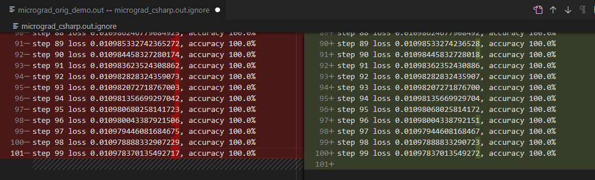

# NMicrograd

This repo is contains a C# reimplementation of https://github.com/karpathy/micrograd; for fun.

One way to use it to:

1. Leave `var copyInitialWeightsFromTheOriginalDemo = true;`
2. Run `dotnet run --project .\NMicrograd.Demo.Console\NMicrograd.Demo.Console.csproj > micrograd_csharp.out.ignore`
3. Compare `micrograd_orig_demo.out` to the output:
   
   `code --diff micrograd_orig_demo.out micrograd_csharp.out.ignore`
   
4. Run unit tests
   