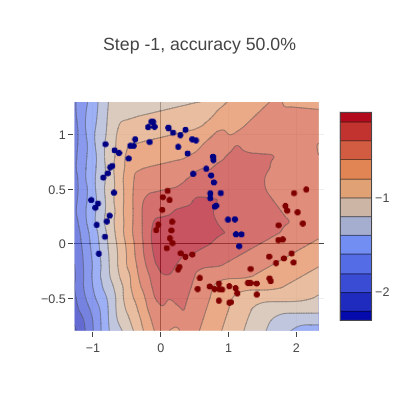
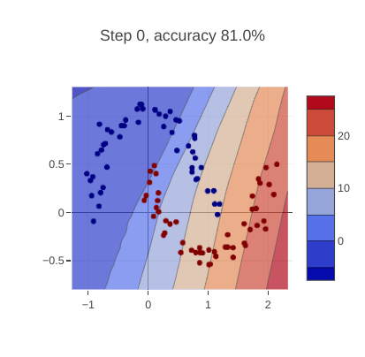
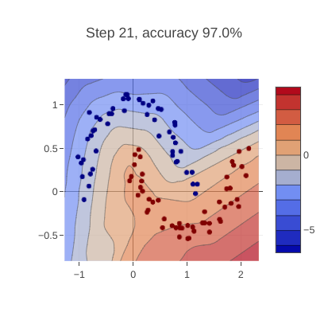
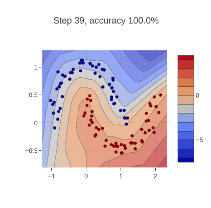

# NMicrograd

This repo is contains a C# reimplementation of https://github.com/karpathy/micrograd; for fun.

One way to enjoy this repo is to install the [.NET Interactive Notebooks](https://marketplace.visualstudio.com/items?itemName=ms-dotnettools.dotnet-interactive-vscode) extension for Visual Studio Code, open demo.ipnyb and play.

Here are some examples that illustrate the learning process:

